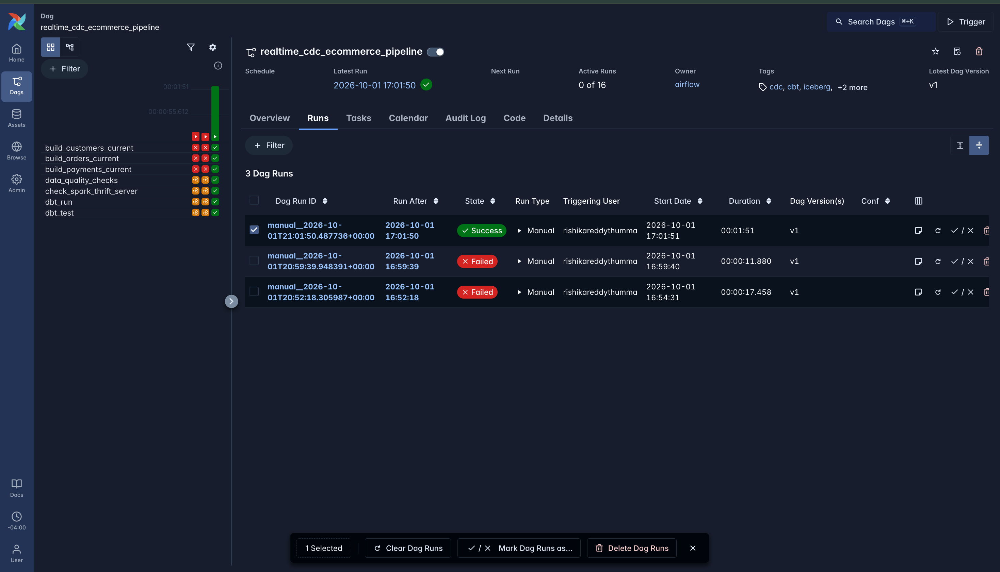

# Real-Time CDC E-Commerce Data Platform
[](https://github.com/Rishika73/realtime-cdc-ecommerce/actions/workflows/ci.yml)

A production-oriented real-time data platform that captures changes from PostgreSQL, streams them through Kafka, processes them with Spark Structured Streaming, and maintains both historical and current-state datasets in Apache Iceberg.

The project also includes automated data-quality validation, dbt analytics models, and Airflow orchestration for an end-to-end data engineering workflow.

---


## Architecture


[View the detailed Mermaid architecture](docs/architecture.md)


---

## What This Project Demonstrates

- Change Data Capture from PostgreSQL using Debezium
- Event-driven ingestion with Apache Kafka
- Real-time processing with Spark Structured Streaming
- Append-only CDC history in Apache Iceberg
- Current-state tables using Iceberg `MERGE`
- Insert, update, and delete event handling
- Automated data-quality validation
- dbt transformations and tests
- Airflow orchestration
- Dockerized local infrastructure

---

## Tech Stack

### Streaming & CDC
- Apache Kafka
- Debezium
- Spark Structured Streaming

### Storage & Modeling
- Apache Iceberg
- PostgreSQL
- dbt

### Orchestration & Infrastructure
- Apache Airflow
- Docker
- Docker Compose

### Languages
- Python
- SQL

---

## Data Flow

Changes made in PostgreSQL are captured through Debezium and published to Kafka topics.

Spark Structured Streaming consumes those events and writes them into two forms:

### CDC History Tables

These tables preserve the full sequence of change events.

```text
local.ecommerce.customer_cdc
local.ecommerce.orders_cdc
local.ecommerce.payments_cdc
```

### Current-State Tables

These tables represent the latest active version of each entity using Iceberg `MERGE`.

```text
local.ecommerce.customers_current
local.ecommerce.orders_current
local.ecommerce.payments_current
```

This design supports both historical event analysis and current-state analytics from the same pipeline.

---

## Data Quality

The validation layer checks:

- Unique customer, order, and payment IDs
- Non-null customer IDs
- Positive order totals
- Positive payment amounts
- Valid customer references on orders
- Valid order references on payments

Example result:

```text
PASS: unique_customer_ids
PASS: unique_order_ids
PASS: unique_payment_ids
PASS: no_null_customer_ids
PASS: positive_order_totals
PASS: positive_payment_amounts
PASS: valid_order_customers
PASS: valid_payment_orders

All data quality checks passed.
```

---

## Analytics Layer

The dbt model `customer_order_summary` combines current-state customer, order, and payment data into an analytics-ready dataset.

It produces:

- Total orders
- Total order value
- Total paid amount
- Customer location information

Example output:

| Customer | City | State | Orders | Order Value | Paid Amount |
|---|---|---|---:|---:|---:|
| Ava Patel | Orlando | TX | 1 | 219.98 | 219.98 |
| Noah Kim | Houston | WA | 1 | 74.99 | 74.99 |
| Mia Johnson | San Francisco | IL | 1 | 149.98 | 149.98 |
| Liam Garcia | Denver | AZ | 1 | 59.99 | 59.99 |
| Emma Brown | Miami | MA | 1 | 134.98 | 134.98 |

dbt test result:

```text
PASS=5
WARN=0
ERROR=0
SKIP=0
TOTAL=5
```

---

## Airflow Orchestration

The pipeline is coordinated through Airflow:

```text
build_customers_current ─┐
build_orders_current ────┼──> data_quality_checks
build_payments_current ──┘
                               |
                               v
                    check_spark_thrift_server
                               |
                               v
                           dbt_run
                               |
                               v
                          dbt_test
```

All seven tasks completed successfully in the final DAG run.



---

## Project Structure

```text
realtime-cdc-ecommerce/
├── .github/
│   └── workflows/
│       └── ci.yml
├── airflow/
│   └── dags/
│       └── realtime_cdc_pipeline.py
├── dbt/
│   ├── models/
│   │   ├── customer_order_summary.sql
│   │   └── schema.yml
│   └── dbt_project.yml
├── debezium/
│   └── postgres-connector.json
├── docs/
│   ├── architecture.md
│   └── screenshots/
│       ├── Real-Time E-Commerce CDC Architecture.png
│       └── airflow_success.png
├── postgres/
│   └── init/
│       ├── 01_schema.sql
│       └── 02_seed_data.sql
├── spark/
│   └── jobs/
│       ├── customer_cdc_stream.py
│       ├── customer_cdc_to_iceberg.py
│       ├── orders_cdc_to_iceberg.py
│       ├── payments_cdc_to_iceberg.py
│       ├── build_customers_current.py
│       ├── build_orders_current.py
│       ├── build_payments_current.py
│       └── data_quality_checks.py
├── docker-compose.yml
├── .gitignore
├── LICENSE
└── README.md
```

---

## Running the Project

### 1. Start the Infrastructure

```bash
docker compose up -d
```

### 2. Register the Debezium Connector

```bash
curl -X POST \
  -H "Content-Type: application/json" \
  --data @debezium/postgres-connector.json \
  http://localhost:8083/connectors
```

### 3. Run a CDC Streaming Job

```bash
docker exec -it ecommerce-spark /opt/spark/bin/spark-submit \
  --conf spark.jars.ivy=/tmp/.ivy2 \
  --packages org.apache.spark:spark-sql-kafka-0-10_2.13:4.1.3,org.apache.iceberg:iceberg-spark-runtime-4.1_2.13:1.11.0 \
  /opt/spark/jobs/customer_cdc_to_iceberg.py
```

### 4. Run dbt

```bash
./dbt/.venv/bin/dbt run \
  --project-dir dbt \
  --select customer_order_summary
```

### 5. Run dbt Tests

```bash
./dbt/.venv/bin/dbt test \
  --project-dir dbt \
  --select customer_order_summary
```

### 6. Start Airflow

```bash
export AIRFLOW_HOME="$PWD/airflow"
./airflow/.venv/bin/airflow standalone
```

### 7. Trigger the DAG

```bash
./airflow/.venv/bin/airflow dags trigger realtime_cdc_ecommerce_pipeline
```

---

## Engineering Highlights

This project covers several production-oriented data engineering patterns:

- Change Data Capture
- Event-driven data pipelines
- Kafka-based streaming
- Spark Structured Streaming
- Apache Iceberg
- Historical and current-state modeling
- Upserts and deletes with `MERGE`
- Decimal decoding
- Data-quality validation
- dbt analytics engineering
- Workflow orchestration with Airflow
- Dockerized data infrastructure

---

## Project Status

The full pipeline is complete and working across:

- PostgreSQL CDC
- Debezium
- Kafka
- Spark Structured Streaming
- Apache Iceberg
- CDC history
- Current-state `MERGE` processing
- Delete handling
- Decimal decoding
- Data-quality validation
- dbt analytics
- dbt tests
- Airflow orchestration
- End-to-end successful DAG execution
